# Being Wealthy — Data Model & Schema Reference

Every field below is verified directly against `src/App.jsx` (not recalled from memory or
design discussion) — grep'd, viewed, and cross-checked against real creation sites as of
this document's writing. Where a field's meaning isn't obvious from its name, the note
explains it; where a design decision shaped the field, that's called out too.

All data lives in the browser's local storage — nothing here is ever sent to a server.
Each top-level structure below is its own storage key, loaded/saved independently.

---

## `transactions[]`

The single, central record of every imported bank/credit-card line item. Every Cash Flow,
Net Worth, Control-screen, and Analyst computation ultimately reads from this array.

```json
{
  "id": "txn_a1b2c3d4",
  "accountId": "acc_9f8e7d6c",
  "importBatchId": "batch_5a4b3c2d",
  "date": "2026-03-05",
  "description": "UPI/419803038/SWIGGY BANGALORE/SWIGGYPAY",
  "merchant": "SWIGGY BANGALORE",
  "amount": 450,
  "direction": "debit",
  "category": "Expense",
  "subCategory": "Variable",
  "tag": "Personal",
  "frequency": null,
  "purpose": "Personal",
  "matchedRuleId": "rule_7e6d5c4b",
  "linkedAccountId": null,
  "linkedTransactionId": null,
  "substantiatedByAccountId": null,
  "transferDismissed": false
}
```

| Field | Type | Notes |
|---|---|---|
| `id` | string | `txn_` prefix, generated on import |
| `accountId` | string | The account this transaction's own statement belongs to — for a Debt-EMI or SIP transaction, this is the **bank** account the money left from, not the loan/investment account it relates to (that's `linkedAccountId`) |
| `importBatchId` | string | Ties every transaction from one statement upload together — used for batch deletion and for the Credit Card Control tab matching a statement's total Expense back to the payment that settled it |
| `date` | string | `YYYY-MM-DD` |
| `description` | string | Raw bank statement text, unmodified |
| `merchant` | string | `normalizeMerchant(description)` — first 3 cleaned words, used for grouping in the "By merchant" review mode |
| `amount` | number | Always positive; `direction` carries the sign |
| `direction` | `"debit"` \| `"credit"` | |
| `category` | `"Income"` \| `"Expense"` \| `"Investment"` \| `"Transfer"` \| `null` | `null` = uncategorized |
| `subCategory` | string \| `null` | See the Category Taxonomy table below — the valid values depend entirely on `category` |
| `tag` | `"Household"` \| `"Personal"` \| `null` | Expense-only |
| `frequency` | `"Monthly"` \| `"Quarterly"` \| `"Semi-Annual"` \| `"Annual"` \| `null` | Only set when `isFrequencyEligible(category, subCategory)` is true (see below) |
| `purpose` | `"Personal"` \| `"Business"` | Defaults to `"Personal"` |
| `matchedRuleId` | string \| `null` | The rule that drove this categorization, if any. **`null` with a real `category` set is the signal for "this was a deliberate manual override"** — `reapplyRules` deliberately never touches these |
| `linkedAccountId` | string \| `null` | Optional. Which specific investment/debt/credit-card account this transaction relates to — see "The `linkedAccountId` System" below |
| `linkedTransactionId` | string \| `null` | Dormant substantiation system only (see Rules doc) — points at the confirmed matching transaction on another account |
| `substantiatedByAccountId` | string \| `null` | Dormant substantiation system only |
| `transferDismissed` | boolean | Dormant substantiation system only |

### Category Taxonomy

| `category` | Valid `subCategory` values | Notes |
|---|---|---|
| `Income` | `Salary`, `Dividend`, `Rent`, `Others` | |
| `Expense` | `Fixed`, `Variable` | Combined with `tag` for the 3-way pill split (`Expense-Fixed`, `Expense-Variable-Household`, `Expense-Variable-Personal`) |
| `Investment` | `SIP`, `Lumpsum`, `Redemption` | |
| `Transfer` | `Self`, `Credit card payment`, `External`, `Debt-EMI`, `Debt-Disbursement`, `Debt-Lumpsum Payment` | The `Debt-` prefix specifically avoids colliding with Investment's bare `Lumpsum` |

### `isFrequencyEligible(category, subCategory)`

Returns true (transaction gets a `frequency`) only for:
`Expense/Fixed`, `Investment/SIP`, `Transfer/Debt-EMI`, `Income/Salary`, `Income/Dividend`, `Income/Rent`.

Everything else (`Variable`, `Lumpsum`, `Redemption`, `Debt-Disbursement`, `Debt-Lumpsum Payment`,
`Income/Others`) is inherently one-off/irregular and never gets a frequency.

### The `linkedAccountId` System

One generic field, not a separate field per case — `linkableAccountTypesFor(category, subCategory)`
returns which account **types** are valid link targets, and that's what drives which accounts
appear in the dropdown:

| `category` / `subCategory` | Valid link target types |
|---|---|
| `Investment` / `SIP`, `Lumpsum`, `Redemption` | `demat`, `mutualFund`, `otherInvestment` |
| `Transfer` / `Debt-EMI`, `Debt-Disbursement`, `Debt-Lumpsum Payment` | `debt` |
| `Transfer` / `Credit card payment` | `creditCard` |
| `Transfer` / `Self` | `bank` (any *other* bank account — a transaction's own `accountId` is excluded from its own dropdown) |
| Everything else | none — field stays `null`, no dropdown shown |

Always optional, never forced at categorization time, and revisitable later from any of the
four categorization UI surfaces (see the Screens document).

---

## `accounts[]`

Every account across every bucket — bank, credit card, debt, investment (equity/mutual fund),
and other investments (PF/Gold/Property) — in one array, distinguished by `type`. Shape varies
meaningfully by type, since each represents a genuinely different kind of financial thing.

### Shared fields (every account type)

```json
{
  "id": "acc_9f8e7d6c",
  "type": "bank",
  "institution": "Standard Chartered Bank",
  "nickname": "SCB Salary Account",
  "active": true
}
```

| Field | Type | Notes |
|---|---|---|
| `id` | string | `acc_` prefix |
| `type` | `"bank"` \| `"creditCard"` \| `"debt"` \| `"demat"` \| `"mutualFund"` \| `"otherInvestment"` | |
| `institution` | string | Bank/broker/lender name |
| `nickname` | string | Display name, defaults to `institution` if not given |
| `active` | boolean | Set via the Accounts screen's picker — governs which account(s) count toward the Free-tier per-bucket limit (see `bucketLimit`/`accountBucket` in the Rules & Enforcement doc) |

### Bank and Credit Card — additional fields

```json
{
  "lastKnownBalance": 124500,
  "uploadHistory": [
    {
      "batchId": "batch_5a4b3c2d",
      "importedAt": 1741234567890,
      "periodStart": "2026-02-01",
      "periodEnd": "2026-02-28",
      "extractedPeriodStart": "2026-02-01",
      "extractedPeriodEnd": "2026-02-28",
      "statementDate": "2026-03-01",
      "parsedOpeningBalance": 98000,
      "parsedClosingBalance": 124500,
      "parsedOpeningTrusted": true,
      "parsedClosingTrusted": true
    }
  ],
  "balanceHistory": [
    { "asOfDate": "2026-02-28", "balance": 124500, "importBatchId": "batch_5a4b3c2d" }
  ]
}
```

| Field | Notes |
|---|---|
| `lastKnownBalance` | The account's most recent confirmed balance — this is what Net Worth, Debt Overview (for credit cards), and `computeDebtSummary`'s CC counterpart all read directly |
| `uploadHistory[]` | One entry per statement imported. `parsedOpeningBalance`/`parsedClosingBalance` are recorded **regardless of trust** — a value that couldn't be confirmed still shows up here for reference, it just won't feed the dashboard equation. `parsedOpeningTrusted`/`parsedClosingTrusted` say whether it passed reconciliation |
| `balanceHistory[]` | **The single source of truth for confirmed balances** — deliberately *not* duplicated onto `uploadHistory`'s own fields (an earlier design had `openingBalance`/`closingBalance` directly on `uploadHistory`; removed because it created two sources of truth that could silently disagree). `asOfDate` was renamed from `date` mid-project — `resolveBalanceAsOfDate` and every reader normalize `h.asOfDate ?? h.date` defensively, since old saved data may still have the pre-rename field name |

**Confidence tiers** (`resolveBalanceAsOfDate`'s return shape): every resolved balance carries a
`tier` of `"exact"` (a real confirmed point on that exact date), `"derived"` (calculated by
walking real transactions forward from the nearest confirmed point), or `"estimate"` (pure
carry-forward with no transaction data to bridge the gap) — never presented identically to a
confirmed number.

### Debt (loans) — additional fields

```json
{ "loanType": "Home Loan" }
```

`loanType` is one of `Home Loan`, `Car Loan`, `Personal Loan`, `Education Loan`,
`Loan Against Property`, `Other`. No `balanceHistory`/`lastKnownBalance` — a loan's current
outstanding is entirely schedule-derived (see `debtSchedules[]` below), read via
`computeDebtSummary`, never stored directly on the account.

### Demat / Mutual Fund (market-tracked investments)

No additional fields beyond the shared set — current value, invested value, and holdings all
live in `holdingSnapshots[]`, keyed by `accountId`. The account record itself is just an
identity; it carries no financial figures of its own.

### Other Investment (PF, Gold, Property)

```json
{ "assetSubtype": "Property", "location": "Bangalore" }
```

`assetSubtype` is one of `PF`, `Gold`, `Property`, `Other`. `location` is only meaningful (and
only ever populated) for `Property`. Financial figures live in `otherInvestments[]`, keyed by
`accountId`, the same pattern as market-tracked investments and `holdingSnapshots[]`.

---

## `rules[]`

The categorization rule set — system-seeded defaults, rules learned automatically from tagging
a transaction, and rules added directly on the Rules screen.

```json
{
  "id": "rule_7e6d5c4b",
  "pattern": "swiggy",
  "category": "Expense",
  "subCategory": "Variable",
  "tag": "Personal",
  "frequency": null,
  "purpose": "Personal",
  "linkedAccountId": null,
  "source": "learned",
  "priority": 6
}
```

| Field | Notes |
|---|---|
| `pattern` | Lowercase substring matched against the normalized transaction description |
| `source` | `"system"` (seeded), `"learned"` (auto-created from tagging a transaction), or `"user"` (added directly on the Rules screen) |
| `priority` | Defaults to `pattern.length` — a longer, more specific pattern naturally outranks a shorter, more generic one on a tie. User-added rules get `pattern.length + 1000`, guaranteeing they always win over a system or learned rule with the same pattern |

`matchRule(description, rules)` picks the highest-priority rule whose pattern appears in the
description; ties are broken by priority order, not insertion order.

---

## `holdingSnapshots[]`

One entry per holding statement import for a demat/mutual-fund account — the entire market-
tracked investment history is a sequence of these, diffed pairwise to compute what changed.

```json
{
  "id": "snap_1a2b3c4d",
  "accountId": "acc_demat123",
  "asOfDate": "2026-02-28",
  "importedAt": 1741234567890,
  "batchId": "batch_9e8f7a6b",
  "instrumentType": "equity",
  "totalInvestedValue": 2500000,
  "totalCurrentValue": 2850000,
  "reconciled": true,
  "holdings": [
    {
      "instrumentKey": "RELIANCE_ISIN123",
      "keyReliable": true,
      "name": "Reliance Industries",
      "isin": "INE002A01018",
      "folioNumber": null,
      "amc": null,
      "sectorOrCategory": "Energy",
      "units": 100,
      "avgCost": 2200,
      "currentPrice": 2450,
      "investedValue": 220000,
      "currentValue": 245000,
      "status": "Active",
      "derived": false
    }
  ]
}
```

| Field | Notes |
|---|---|
| `totalInvestedValue` / `totalCurrentValue` | The **trusted** totals — the statement's own printed total where it reconciles against the sum of individual holdings, the summed figure otherwise (`reconciled` records which happened) |
| `holdings[].instrumentKey` | The stable identity used to track one specific holding across snapshots — `isin` or `folioNumber` when genuinely per-holding, never an account-level number (a PRAN or policy number) that would be identical across every row |
| `holdings[].derived` | Whether this holding's value was calculated from two others rather than read directly off the statement |

`computeSnapshotTransition(prevSnapshot, currSnapshot)` is the function that diffs two
consecutive snapshots into `{ added, redeemed, growth, ... }`. **Critically, this only produces
a meaningful "addition" figure between two real, confirmed snapshots** — calling it with
`prevSnapshot = null` (the very first snapshot for an account) treats the *entire* opening
balance as a fresh addition, which is correct in some contexts but was the exact cause of a real
bug in Investments Control (years of pre-app investment history counted as current-period
activity). Any code walking a full snapshot history for a "this period's activity" figure must
start from the second snapshot, not the first.

---

## `debtSchedules[]`

A loan's amortization schedule. **Append-only, not replace-on-reupload** — multiple schedules
for the same account can and do coexist (e.g. a revised schedule uploaded after a prepayment).

```json
{
  "id": "debt_3c4d5e6f",
  "accountId": "acc_loan789",
  "importedAt": 1741234567890,
  "entries": [
    {
      "period": "2026-03",
      "openingBalance": 4500000,
      "emi": 42000,
      "principal": 18000,
      "interest": 24000,
      "closingBalance": 4482000
    }
  ]
}
```

**Resolving overlapping periods**: when more than one uploaded schedule for the same account has
an entry for the same `period` (e.g. after a prepayment triggers a fresh, revised schedule
covering months the original schedule also covered), the entry from whichever schedule has the
more recent `importedAt` wins. Already-passed months naturally stay on the original schedule,
since a later revision has no entries for periods before it existed. This resolution rule is
implemented independently in `computeDebtSummary`, `DebtOverview`, and `DebtControlView` — all
three must agree, since they'd otherwise show different EMI/outstanding figures for the same
period.

---

## `otherInvestments[]`

Entries for PF, Gold, and Property accounts.

```json
{
  "id": "oi_2b3c4d5e",
  "accountId": "acc_other456",
  "asOfDate": "2026-02-28",
  "units": 50,
  "unitOfMeasure": "grams",
  "costPerUnit": 5200,
  "currentPerUnit": 6800,
  "investedValue": 260000,
  "currentValue": 340000,
  "location": null,
  "derived": true,
  "importedAt": 1741234567890
}
```

`deriveOtherInvestmentFields` fills in whichever of `units`/`costPerUnit`/`investedValue`/
`currentValue` weren't directly entered, from whichever others are known (e.g. `investedValue`
from `units × costPerUnit`) — the person only needs to supply enough fields to make the rest
computable, not all of them every time.

---

## Smaller structures

```json
// budgets — object, not array, keyed by the same pill-class keys used in Cash Flow
{ "Expense-Fixed": 15000, "Expense-Variable-Household": 20000, "Expense-Variable-Personal": 12000 }

// merchantAliases[] — groups near-duplicate merchant strings under one display name.
// Purely cosmetic: categorization rules always match the original, ungrouped text.
[{ "id": "mg_1a2b", "canonical": "Scapia", "variants": ["UPI SCAPIA SCAPIA", "UPI SCAPIA TECHNOLOGY"] }]

// license — null (Free tier) or the verified payload from a pasted license key
{ "email": "user@example.com", "tier": "licensed", "keyId": "lic_abc123", "issuedAt": "2026-01-01", "expiresAt": "2027-01-01" }
```

---

## `goals[]`

Two structurally different shapes depending on time horizon — a goal due in under a year is
funded from specific named holdings; a goal a year or more away is funded as a share of one
pooled portfolio value. See the Screens document (Goals) for the full funding-model reasoning.

```json
// Near-term (yearsToGoal < 1) — Emergency Fund
{
  "id": "goal_1a2b3c",
  "createdAt": 1741234567890,
  "name": "6-month safety net",
  "type": "emergency",
  "yearsToGoal": 0.5,
  "emergencyMonths": 6,
  "assignedInstrumentKeys": ["FD_HDFC_001", "LIQUIDFUND_002"]
}

// Near-term — any other type
{
  "name": "Car down payment", "type": "vehicle", "yearsToGoal": 0.75,
  "costToday": 500000, "costIsEstimate": false,
  "inflationRate": 0, "returnRate": 0,
  "assignedInstrumentKeys": ["FD_HDFC_001"]
}

// Long-term (yearsToGoal >= 1)
{
  "name": "MBA abroad", "type": "education", "yearsToGoal": 8,
  "costToday": 4000000, "costIsEstimate": true,
  "inflationRate": 8, "returnRate": 12,
  "manualLumpsumAllocation": 200000,
  "sipPlannedMonthly": 15000, "sipStartDate": "2026-04-01"
}
```

Near-term goals always have `inflationRate: 0, returnRate: 0` regardless of type — inflation/
growth assumptions don't apply to money that's already sitting in specific, currently-liquid
holdings. `assignedInstrumentKeys` references the same `instrumentKey` values used in
`holdingSnapshots[].holdings[]`.

---

## Architecture — Data Flow

How data moves from a raw statement upload through to every screen that reads it. Each solid
arrow is a direct read/write dependency; the diagram groups by which raw structure ultimately
feeds which computation.

```mermaid
flowchart TB
    subgraph Import["Import Flows"]
        UploadTab["UploadTab\n(bank / credit card)"]
        InvFlow["InvestmentImportFlow"]
        DebtFlow["DebtImportFlow"]
        OtherFlow["OtherInvestmentsPanel"]
    end

    subgraph RawData["Raw Data (localStorage)"]
        TXN[("transactions[]")]
        ACC[("accounts[]")]
        HS[("holdingSnapshots[]")]
        DS[("debtSchedules[]")]
        OI[("otherInvestments[]")]
        RULES[("rules[]")]
    end

    subgraph Categorize["Categorization (Review tab)"]
        ByMerchant["By merchant (bulk)"]
        ByTxn["By transaction"]
        BulkBar["Bulk action bar"]
        RulesTab["Rules tab"]
    end

    subgraph Derived["Shared Derived Computations"]
        Resolver["resolveAccountBalanceForPeriod\n(3-tier confidence)"]
        SnapDiff["computeSnapshotTransition"]
        DebtSum["computeDebtSummary"]
        NWSum["computeNetWorthSummary"]
    end

    subgraph Pillars["Pillar Screens"]
        CashFlow["Cash Flow"]
        NetWorth["Net Worth"]
        InvOverview["Investments"]
        DebtOverview["Debt"]
        Goals["Goals"]
    end

    subgraph Controls["Control Screens (reconciliation only)"]
        TransCtrl["Transfers Control"]
        InvCtrl["Investments Control"]
        DebtCtrl["Debt Control"]
    end

    subgraph Chat["Analyst / Personal CFO"]
        PersonaChat["PersonaChatScreen"]
    end

    UploadTab -->|writes| TXN
    UploadTab -->|writes uploadHistory,\nbalanceHistory| ACC
    InvFlow -->|writes| HS
    InvFlow -->|creates| ACC
    DebtFlow -->|writes| DS
    DebtFlow -->|creates| ACC
    OtherFlow -->|writes| OI
    OtherFlow -->|creates| ACC

    RULES -->|auto-categorize on import| TXN
    ByMerchant -->|tag + learn rule| TXN
    ByMerchant -->|creates/updates| RULES
    ByTxn -->|tag + learn rule| TXN
    ByTxn -->|creates/updates| RULES
    BulkBar -->|tag + learn rule| TXN
    RulesTab -->|manage| RULES
    RulesTab -.->|re-apply, skips\nmanual overrides| TXN

    ACC -->|balanceHistory| Resolver
    TXN -->|transactions since\nlast confirmed point| Resolver
    HS -->|consecutive pairs| SnapDiff
    DS -->|merged, most-recent-\nwins per period| DebtSum

    Resolver --> CashFlow
    TXN --> CashFlow
    ACC --> NetWorth
    HS --> NetWorth
    OI --> NetWorth
    DS --> NetWorth
    NWSum --> NetWorth
    HS --> InvOverview
    SnapDiff --> InvOverview
    OI --> InvOverview
    ACC --> DebtOverview
    DebtSum --> DebtOverview
    HS --> Goals
    ACC --> Goals

    TXN -->|Self, linked pairs| TransCtrl
    TXN -->|SIP/Lumpsum/Redemption| InvCtrl
    SnapDiff -->|added/redeemed,\nfrom 2nd snapshot on| InvCtrl
    TXN -->|Debt-EMI/Disbursement/\nLumpsum, CC payments| DebtCtrl
    DS -->|schedule-side EMI| DebtCtrl
    ACC -->|CC statement totals| DebtCtrl

    TXN --> PersonaChat
    ACC --> PersonaChat
    HS --> PersonaChat
    Goals -.-> PersonaChat
```



**Reading this diagram**: the three Control screens deliberately never appear as a data
*source* for anything — they're pure reconciliation views, always downstream, never feeding
back into a pillar screen's own numbers. `resolveAccountBalanceForPeriod` and
`computeSnapshotTransition` are each used in more than one place (Cash Flow and the account-
level `AccountsHistoryPanel` for the resolver; Investments Overview and Investments Control for
the snapshot diff) — both are written once and shared, specifically so two screens can never
silently disagree about the same underlying number.


